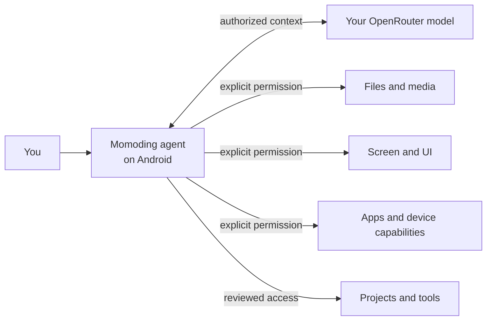

<p align="center">
  
</p>

# Momoding

<p align="center"><strong>A personal AI agent that lives on your devices — starting with Android.</strong></p>

Momoding is a local-first personal AI agent that is starting on Android. Give it a task and it can
keep the context, make a plan, ask for the authority it needs, use approved device capabilities,
and report what happened. It is designed to grow from conversation into action while keeping the
user and the device platform in control.

[简体中文](README.zh-CN.md)

> **Developer preview:** this repository is suitable for source review and local development. It
> is not yet a production or Play Store release, and it has not received an independent security
> audit.

## Platform status

| Platform | Current status |
| --- | --- |
| Android | Current primary implementation; open-source developer preview |
| iOS | Planning and feasibility exploration; no committed release date |
| Other platforms | Long-term direction; no committed form or release date |

Momoding's product vision is not Android-only, but this repository and the currently runnable
preview support Android only. Platform permissions and system capabilities differ, so future
versions are not expected to copy every Android capability one-for-one.

## Positioning

Momoding's long-term direction is a general-purpose personal agent across devices, starting with
Android; it is not a coding-first product. Coding, project files, and terminal tools are one
capability family alongside photos, camera, screen context, bounded UI actions, app information,
attachments, and shared storage.

It is also more than a voice-assistant entry point or a chatbot wrapper. Momoding is organized
around durable tasks: it can plan, use tools, wait for approval, recover state, and continue work
across sessions. The Pi agent runtime executes on the device, while Android remains the authority
for credentials, permissions, policy decisions, and device-side effects.

“Local-first” does not mean fully offline. Authorized prompts, context, and tool results are sent to
the OpenRouter model selected by the user. It means the agent's control plane stays on the
device: the API key, task state, capability state, approvals, and side-effect records are owned by
the Android application.

Momoding is built around four product principles:

- **The agent lives with the phone.** Its task loop, state, and capability model are part of the
  Android application rather than a thin remote-control surface.
- **Authority stays explicit.** A model request does not automatically grant file, screen,
  accessibility, package, or shared-storage access.
- **Tasks outlive a chat turn.** Plans, goals, tool results, approvals, and recovery state can remain
  attached to the work.
- **The interface tells the truth.** Capabilities reflect live Android availability and permission
  state; unavailable paths are not presented as working.



## Who it is for

The long-term direction is for people who want one AI agent to help across chat boxes, app silos,
and devices. The current developer preview first tests that experience on Android phones.

The current open-source developer preview is best suited to Android power users, developers, and
researchers who value bring-your-own-key model access, inspectable source, explicit permission
boundaries, and review before side effects. It is not yet a consumer-ready assistant or a hardened
sandbox for hostile code.

Momoding is an independent project. It is not affiliated with or endorsed by OpenAI, OpenRouter,
Shizuku, or the upstream Pi maintainers.

## What Momoding can do today

- Persistent tasks, plans, goals, child agents, skills, attachments, approvals, and recovery state.
- On-device Pi agent loop in QuickJS with a user-selected OpenRouter model.
- Bring-your-own-key setup with Android Keystore-backed credential encryption.
- Photo metadata, camera capture, share-sheet import, text attachments, and shared-storage tools.
- Bounded calendar and contact lookup plus create, update, and delete flows that use opaque handles,
  Android runtime permissions, approval policy, and post-operation verification.
- Foreground current-location lookup with an explicit purpose and requested coarse or precise
  accuracy; Momoding does not request background location.
- Foreground clipboard read, set, and clear flows with sensitive-content filtering and bounded
  output.
- Momoding-owned notification post, list, update, and cancel flows; it does not read or control
  other apps' notifications.
- Opaque-handle photo-library favorite, trash, restore, and delete flows with Android system consent
  where the platform requires it.
- User-started screen capture plus accessibility-based UI inspection and bounded UI actions.
- Read-only installed-package listing and inspection through a separately installed and authorized
  Shizuku service.
- User-authorized project folders, bounded content reads, prepared diffs, and explicit write
  confirmation.
- A phone-local Linux project runtime with model-visible command and test tools in supported debug
  builds.

These Android domain tools are still experimental. The current physical-device gate is not a full
release pass: calendar CRUD, precise location, clipboard, Momoding-owned notifications, and a core
media favorite flow were exercised on a Xiaomi 12X running Android 13, but lifecycle coverage
remains incomplete. Deleting a contact stored in a Xiaomi account could not be verified because
that device's contacts provider retained the record. Provider-dependent mutations must therefore
fail closed and should not be treated as universally supported.

## How Momoding keeps authority visible

| Capability | Current boundary |
| --- | --- |
| API key | Encrypted locally; never intentionally placed in JavaScript, logs, or the APK |
| Project folders | Selected by the user through Android's Storage Access Framework |
| File contents | Read through task-scoped tools and current Android grants |
| File changes | Prepared first, shown for review, and committed only after Android policy checks |
| Shared storage | Requires the Android all-files access setting; the app reports the live state |
| Calendar | Separate read/write permissions; mutations are prepared, policy-checked, and verified |
| Contacts | Separate read/write permissions; opaque handles and live conflict checks; provider behavior varies |
| Current location | Foreground only; coarse/precise permission and capture time/accuracy are reported |
| Clipboard | Foreground only; bounded text, sensitive-content filtering, and verified mutations |
| Notifications | Android notification permission; only the app's own bounded notification channel |
| Photo mutations | Current photo-library scope, opaque handles, policy checks, and Android consent |
| Screen capture | Requires a user-started MediaProjection session; captured images are turn-local |
| UI control | Requires the accessibility service; actions use fresh opaque node handles |
| Package facts | Requires Shizuku; limited to bounded read-only list and inspection operations |
| Project commands | Run inside a PRoot/Alpine environment; PRoot is not a hostile-code sandbox |
| Model provider | Authorized prompt and tool content is sent to the selected OpenRouter model |

See [Security model](docs/SECURITY_MODEL.md) for details. This design reduces accidental authority;
it is not a security proof.

## Repository layout

```text
android-app/        Android application, Room storage, device policies, UI, and tests
mobile-runtime-js/  Pinned Pi runtime bundle built for QuickJS
wire/               Shared protocol schemas and Kotlin contract
scripts/            Runtime builders, verification, and public-release checks
third_party/        Reviewed patches needed to reproduce optional native components
```

The public repository is generated from an explicit allowlist in the private source repository.
Internal research, device captures, credentials, the remote-host service and internal orchestration,
and historical validation artifacts are excluded. Public client and wire contracts needed by the
Android application remain included. See [Open-source scope](OPEN_SOURCE_SCOPE.md).

## Prerequisites

- JDK 17
- Android SDK Platform 37, Build Tools 37.0.0, and NDK 28.2.13676358
- Node.js 22.22.3 and npm 10.9.8
- Git, curl, patch, and ripgrep

Set `JAVA_HOME` and `ANDROID_HOME`. Do not commit `local.properties`.

## Build and test

```bash
npm ci --prefix mobile-runtime-js
npm run check --prefix mobile-runtime-js

JAVA_HOME=/path/to/jdk-17 \
ANDROID_HOME=/path/to/android-sdk \
./android-app/gradlew -p android-app \
  testDebugUnitTest lintDebug assembleDebug assembleRelease
```

The debug build downloads pinned PRoot, talloc, and Alpine sources/assets, verifies their SHA-256
digests, and creates the phone-local project runtime. Do not redistribute a generated APK until
all corresponding-source and third-party notice obligations have been reviewed.

For the full repository gate:

```bash
./scripts/verify.sh
```

## Contributing and security

Read [CONTRIBUTING.md](CONTRIBUTING.md) before opening a pull request. Report suspected
vulnerabilities privately as described in [SECURITY.md](SECURITY.md); never put real credentials,
private project files, or diagnostics archives in a public issue.

## License

Momoding-authored source is available under the [MIT License](LICENSE). Bundled and build-fetched
components keep their original licenses; see [THIRD_PARTY_NOTICES.md](THIRD_PARTY_NOTICES.md).
