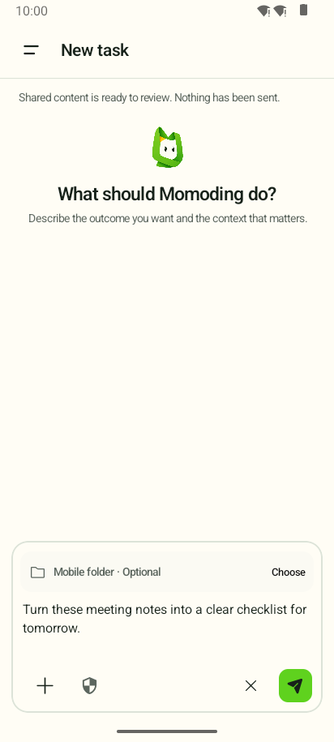
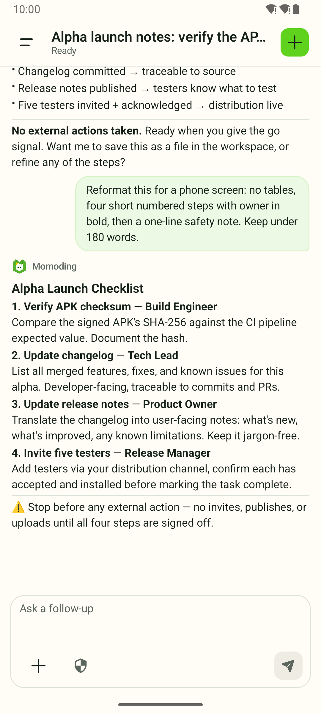
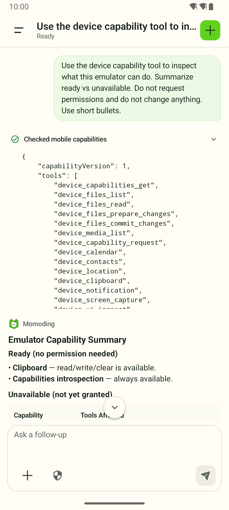

<p align="center">
  
</p>

<h1 align="center">Momoding</h1>

<p align="center"><strong>Share something. Let the task continue on your phone.</strong></p>

<p align="center">
  An open-source, local-first personal AI agent for Android. Momoding keeps task state on your
  device, works with the capabilities you approve, and shows you what happened.
</p>

<p align="center">
  <a href="https://github.com/1zhangyy1/momoding/releases/tag/v0.1.0-alpha.4"><strong>Download alpha.4</strong></a>
  · <a href="#quick-start">Quick start</a>
  · <a href="README.zh-CN.md">简体中文</a>
</p>

<p align="center">
  <a href="https://github.com/1zhangyy1/momoding/releases"></a>
  <a href="LICENSE"></a>
  
</p>

> **Developer preview:** Momoding is ready for source review and early testing, not production use.
> It is not on Google Play and has not received an independent security audit.

## From share sheet to a durable task

Send text, an image, or a link to Momoding from another Android app. Keep working in the same task,
add files or photos, and let the on-device agent use only the Android capabilities you enable.

<p align="center">
  <br />
  <strong>1. Share into a task</strong><br />
  <sub>Review first; nothing is sent automatically.</sub>
</p>

<p align="center">
  <br />
  <strong>2. Get a reviewable result</strong><br />
  <sub>Continue the same task and keep consequential actions paused.</sub>
</p>

<p align="center">
  <br />
  <strong>3. See every phone tool call</strong><br />
  <sub>Tool activity and live permission state stay visible.</sub>
</p>

Screenshots show the signed public alpha.4 APK on an Android API 35 emulator. The task text is
synthetic; the model responses and capability check are real executions from the capture session.
See the [capture notes](docs/assets/screenshots/README.md).

Momoding is not a remote-control shell or a chatbot wrapper. The Pi agent loop runs on the phone;
Android owns credentials, permissions, policy checks, and device-side effects.

**The loop:** share real context → continue a durable task → approve model or phone access → review
the visible result.

- **Bring in real context:** text, images, links, files, or a new camera capture.
- **Keep the work alive:** the conversation, plan, goal, tool results, and recovery state stay with
  the task.
- **Stay in control:** system permissions, sensitive reads, and consequential changes remain
  explicit.

## What you can try today

- **Continue something from another app.** Share text, an image, or a link into a new task instead
  of rebuilding the context in another chat box.
- **Work with phone context.** Attach files and photos, take a photo, inspect photo metadata, or use
  bounded calendar, contact, location, clipboard, and Momoding-owned notification tools.
- **Run work that lasts longer than one reply.** Tasks can carry plans, goals, skills, child agents,
  approvals, and recovery state across sessions.
- **Use powerful Android capabilities deliberately.** Screen capture, accessibility-based UI
  inspection and bounded actions, shared storage, and package facts each have their own system gate.

These capabilities are experimental and vary by Android version and device provider. Momoding
reports live permission and availability state and is designed to fail closed when it cannot verify
an operation.

## Quick start

1. On a device running **Android 11 or newer**, download the signed
   [`momoding-0.1.0-alpha.4.apk`](https://github.com/1zhangyy1/momoding/releases/download/v0.1.0-alpha.4/momoding-0.1.0-alpha.4.apk)
   and its [SHA-256 checksum](https://github.com/1zhangyy1/momoding/releases/download/v0.1.0-alpha.4/momoding-0.1.0-alpha.4.apk.sha256).
2. Allow your browser or file manager to install this app when Android asks. The package name is
   `app.momoding`.
3. Choose a model connection in Momoding:
   - sign in with ChatGPT for the optional Codex provider; or
   - enter your own OpenRouter API key and choose a supported model.
4. Start a task in Momoding, or use Android's **Share** action from another app.

Momoding never bundles a model credential. From alpha.3 onward, you can use
`Settings → About Momoding → Check for updates`; the app verifies the checksum, package identity,
version, and release signer before opening Android's installer. Android still requires your
confirmation.

The public APK is the Core release build. It includes the on-device Pi agent and reviewed Android
capabilities, but excludes the debug-only PRoot/Alpine project-command environment.

## Privacy, network, and analytics

The current alpha contains **no product analytics, advertising, or crash-reporting SDK**. There is
also no Momoding account or Momoding-operated cloud sync.

“Local-first” does not mean fully offline:

- credentials, task state, capability state, approvals, and side-effect records stay under the
  Android application's control;
- prompts and tool content you authorize are sent to the model provider you selected;
- update checks and downloads contact GitHub Releases; and
- system capabilities use the Android permissions shown by the app and the operating system.

For this early open-source phase, project learning comes from public release downloads, stars,
issues, and direct user reports. If optional telemetry is ever proposed, it should be documented,
minimal, content-free, and off by default before it ships.

## Authority stays visible

| Capability | Current boundary |
| --- | --- |
| Provider credentials | Encrypted locally with Android Keystore support; not intentionally exposed to the JavaScript runtime, logs, or APK |
| Model requests | Only authorized prompt and tool content is sent to the selected Codex or OpenRouter service |
| Project folders | Selected by the user through Android's Storage Access Framework |
| File changes | Prepared first, shown for review, and committed only after policy checks |
| Calendar and contacts | Separate runtime permissions; mutations are prepared and verified; provider behavior may vary |
| Location and clipboard | Foreground only, bounded, and subject to Android permission and content checks |
| Photos | Scoped access, opaque handles, policy checks, and Android consent where required |
| Screen and UI control | User-started screen capture or an explicitly enabled accessibility service; UI actions use fresh node handles |
| Installed apps | Separately authorized Shizuku service; bounded, read-only package facts |
| Project commands | Debug builds only; PRoot is not a hostile-code sandbox |

Read the [security model](docs/SECURITY_MODEL.md) for the complete boundary. These controls reduce
accidental authority; they are not a security proof.

## Current status

| Platform | Status |
| --- | --- |
| Android | Primary implementation; open-source developer preview |
| iOS | Feasibility exploration; no committed release date |
| Other platforms | Long-term direction; no committed form or release date |

The current Android domain-tool gate is not a full release pass. Calendar CRUD, precise location,
clipboard, Momoding-owned notifications, and a core media-favorite flow were exercised on a Xiaomi
12X running Android 13, but lifecycle and device-provider coverage remain incomplete. In particular,
a Xiaomi-account contact deletion could not be verified because the provider retained the record.

See the [changelog](CHANGELOG.md) for release-by-release details. Momoding is an independent project
and is not affiliated with or endorsed by OpenAI, OpenRouter, Shizuku, or the upstream Pi
maintainers.

## Build from source

### Prerequisites

- JDK 17
- Android SDK Platform 37.0 (`platforms;android-37.0`), Build Tools 37.0.0, and NDK 28.2.13676358
- Node.js 22.22.3 and npm 10.9.8
- Git, curl, patch, and ripgrep

Set `JAVA_HOME` and `ANDROID_HOME`. Do not commit `local.properties`.

```bash
npm ci --prefix mobile-runtime-js
npm run check --prefix mobile-runtime-js

JAVA_HOME=/path/to/jdk-17 \
ANDROID_HOME=/path/to/android-sdk \
./android-app/gradlew -p android-app \
  testDebugUnitTest lintDebug assembleDebug assembleRelease
```

The debug build downloads pinned PRoot, talloc, and Alpine sources/assets, verifies their SHA-256
digests, and creates the phone-local project runtime. Do not redistribute a generated APK until all
corresponding-source and third-party notice obligations have been reviewed.

Run the complete repository gate with:

```bash
./scripts/verify.sh
```

## Repository map

```text
android-app/        Android application, Room storage, device policies, UI, and tests
mobile-runtime-js/  Pinned Pi runtime bundle built for QuickJS
wire/               Shared protocol schemas and Kotlin contract
scripts/            Runtime builders, verification, and public-release checks
third_party/        Reviewed patches needed to reproduce optional native components
```

This public repository is generated from an explicit allowlist. Internal research, device captures,
credentials, remote-host services, internal orchestration, and historical validation artifacts are
excluded. See the [open-source scope](OPEN_SOURCE_SCOPE.md).

## Help shape Momoding

- Try the latest alpha and tell us the first task you wanted Momoding to complete.
- [Open a feature request](https://github.com/1zhangyy1/momoding/issues/new?template=feature_request.yml)
  for a concrete workflow, not just a capability name.
- [Report a reproducible bug](https://github.com/1zhangyy1/momoding/issues/new?template=bug_report.yml)
  without credentials, private files, account details, or device identifiers.
- Read [CONTRIBUTING.md](CONTRIBUTING.md) before opening a pull request. Report suspected
  vulnerabilities privately as described in [SECURITY.md](SECURITY.md).

## License

Momoding-authored source is available under the [MIT License](LICENSE). Bundled and build-fetched
components keep their original licenses; see [THIRD_PARTY_NOTICES.md](THIRD_PARTY_NOTICES.md).
