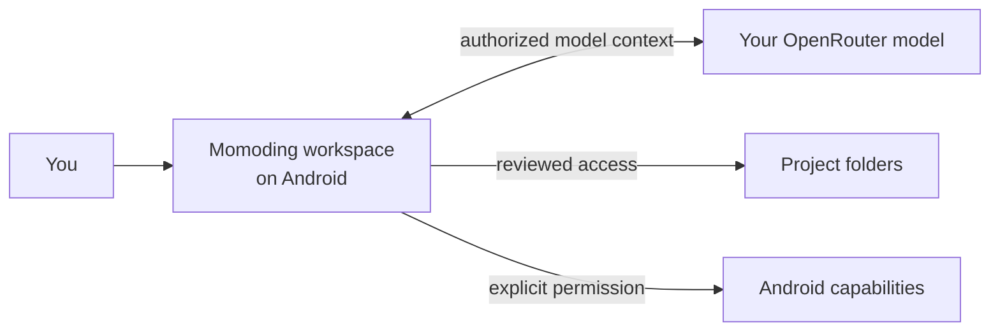

<p align="center">
  
</p>

# Momoding

<p align="center"><strong>AI coding, shaped for Android.</strong></p>

Momoding turns an Android device into a local-first AI coding workspace. It gives an AI agent a
durable place to understand a project, plan work, use tools, review changes, and continue across
sessions—without reducing the phone to a remote control for an agent running somewhere else.

[简体中文](README.zh-CN.md)

> **Developer preview:** this repository is suitable for source review and local development. It
> is not yet a production or Play Store release, and it has not received an independent security
> audit.

## Positioning

Momoding sits between a chat assistant and a desktop or cloud coding agent. It brings the working
loop onto Android: the Pi agent runtime executes on the device, task and recovery state stay
durable, and Android remains the authority for credentials, permissions, policy decisions, and
device-side effects.

“Local-first” does not mean fully offline. Authorized prompts, context, and tool results are sent to
the OpenRouter model selected by the user. It means the workspace's control plane stays on the
device: the API key, task state, capability state, approvals, and side-effect records are owned by
the Android application.

Momoding is built around three product principles:

- **The phone is a workspace, not just a remote.** The agent loop and task lifecycle can run on the
  Android device.
- **Authority stays explicit.** A model request does not automatically grant file, screen,
  accessibility, package, or shared-storage access.
- **The interface tells the truth.** Capabilities reflect live Android availability and permission
  state; unavailable paths should not be presented as working.



## Who it is for

Momoding is for developers and researchers exploring what an Android-native coding agent can be,
especially those who value bring-your-own-key model access, inspectable source, explicit permission
boundaries, and review before side effects.

It is not currently a consumer-ready assistant, a hardened sandbox for hostile code, or a supported
replacement for a production desktop IDE.

Momoding is an independent project. It is not affiliated with or endorsed by OpenAI, OpenRouter,
Shizuku, or the upstream Pi maintainers.

## What Momoding can do today

- On-device Pi agent loop in QuickJS; Node.js is used to build and test the bundled runtime.
- OpenRouter bring-your-own-key setup with Android Keystore-backed credential encryption.
- Persistent tasks, plans, goals, child agents, skills, attachments, approvals, and recovery state.
- User-authorized project folders, bounded content reads, prepared diffs, and explicit write
  confirmation.
- A phone-local Linux project runtime with model-visible command and test tools in supported debug
  builds.
- Photo metadata, camera capture, share-sheet import, text attachments, and shared-storage tools.
- User-started screen capture plus accessibility-based UI inspection and bounded UI actions.
- Read-only installed-package listing and inspection through a separately installed and authorized
  Shizuku service.

## How Momoding keeps authority visible

| Capability | Current boundary |
| --- | --- |
| API key | Encrypted locally; never intentionally placed in JavaScript, logs, or the APK |
| Project folders | Selected by the user through Android's Storage Access Framework |
| File contents | Read through task-scoped tools and current Android grants |
| File changes | Prepared first, shown for review, and committed only after Android policy checks |
| Shared storage | Requires the Android all-files access setting; the app reports the live state |
| Screen capture | Requires a user-started MediaProjection session; captured images are turn-local |
| UI control | Requires the accessibility service; actions use fresh opaque node handles |
| Package facts | Requires Shizuku; limited to bounded read-only list and inspection operations |
| Project commands | Run inside a PRoot/Alpine environment; PRoot is not a hostile-code sandbox |
| Model provider | Authorized prompt and tool content is sent to the selected OpenRouter model |

See [Security model](docs/SECURITY_MODEL.md) for details. This design reduces accidental authority;
it is not a security proof.

## Repository layout

```text
android-app/        Android application, Room storage, device policies, UI, and tests
mobile-runtime-js/  Pinned Pi runtime bundle built for QuickJS
wire/               Shared protocol schemas and Kotlin contract
scripts/            Runtime builders, verification, and public-release checks
third_party/        Reviewed patches needed to reproduce optional native components
```

The public repository is generated from an explicit allowlist in the private source repository.
Internal research, device captures, credentials, the remote-host service and internal orchestration,
and historical validation artifacts are excluded. Public client and wire contracts needed by the
Android application remain included. See [Open-source scope](OPEN_SOURCE_SCOPE.md).

## Prerequisites

- JDK 17
- Android SDK Platform 37, Build Tools 37.0.0, and NDK 28.2.13676358
- Node.js 22.22.3 and npm 10.9.8
- Git, curl, patch, and ripgrep

Set `JAVA_HOME` and `ANDROID_HOME`. Do not commit `local.properties`.

## Build and test

```bash
npm ci --prefix mobile-runtime-js
npm run check --prefix mobile-runtime-js

JAVA_HOME=/path/to/jdk-17 \
ANDROID_HOME=/path/to/android-sdk \
./android-app/gradlew -p android-app \
  testDebugUnitTest lintDebug assembleDebug assembleRelease
```

The debug build downloads pinned PRoot, talloc, and Alpine sources/assets, verifies their SHA-256
digests, and creates the phone-local project runtime. Do not redistribute a generated APK until
all corresponding-source and third-party notice obligations have been reviewed.

For the full repository gate:

```bash
./scripts/verify.sh
```

## Contributing and security

Read [CONTRIBUTING.md](CONTRIBUTING.md) before opening a pull request. Report suspected
vulnerabilities privately as described in [SECURITY.md](SECURITY.md); never put real credentials,
private project files, or diagnostics archives in a public issue.

## License

Momoding-authored source is available under the [MIT License](LICENSE). Bundled and build-fetched
components keep their original licenses; see [THIRD_PARTY_NOTICES.md](THIRD_PARTY_NOTICES.md).
