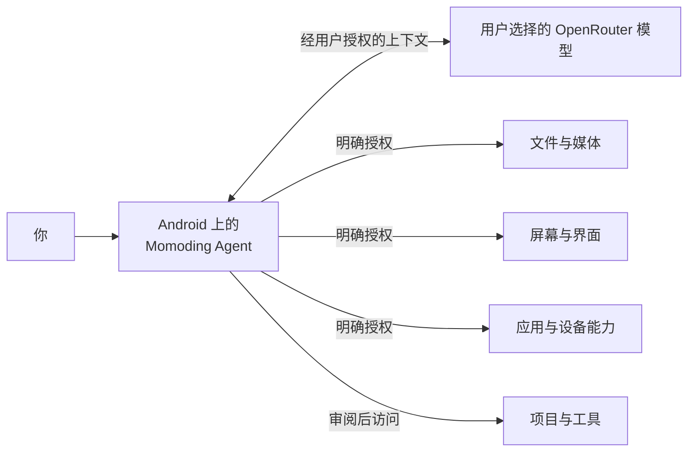

<p align="center">
  
</p>

# Momoding

<p align="center"><strong>住在你设备里的个人 AI Agent，从 Android 开始。</strong></p>

Momoding 是一个本地优先的个人 AI Agent，当前从 Android 开始。你给它一个任务，它可以记住
上下文、制定计划、请求所需权限、调用已经授权的设备能力，并把执行结果交还给你。Momoding
希望让 AI 从“陪你聊天”走向“帮你做事”，同时让控制权始终留在用户和设备平台手中。

[English](README.md)

> **开发者预览版：** 当前仓库适合源码审阅和本地开发，但还不是正式发行版或 Play 商店版本，
> 也尚未经过独立安全审计。

## 安装 Android Alpha

请从 [GitHub Releases](https://github.com/1zhangyy1/momoding/releases) 下载已签名的
`momoding-0.1.0-alpha.4.apk` 和对应的 SHA-256 校验文件。Android 可能要求你允许浏览器或文件
管理器“安装未知应用”。Momoding 不会内置模型凭据；首次设置时请填写你自己的 OpenRouter
API Key。

从 alpha.3 开始，可以在 `设置 → 关于 Momoding → 检查更新` 中检查 GitHub Releases。下载完成
后，Momoding 会校验文件摘要、包名、新版本号和发布签名，再打开 Android 系统安装器。alpha.2
及更早版本需要手动安装一次 alpha.3；后续版本才可以由 App 内发现。

公开 Alpha 是 Core Release 构建：包含运行在手机上的 Pi Agent 和已经审阅的 Android 能力，
但不包含只用于 Debug 构建的 PRoot/Alpine 项目命令环境。

## 平台进展

| 平台 | 当前状态 |
| --- | --- |
| Android | 当前主要实现；开源开发者预览版 |
| iOS | 规划与可行性探索中；尚未承诺发布日期 |
| 其他平台 | 长期方向；尚未承诺具体形态或发布日期 |

Momoding 的产品愿景不是 Android-only，但当前仓库和当前可运行版本确实只支持 Android。不同
平台提供的权限和系统能力不同，未来版本不会承诺逐项复制 Android 能力。

## 产品定位

Momoding 的长期方向是跨设备的通用个人 Agent，当前实现从 Android 开始；它不是一款以编程
为主的产品。编程、项目文件和终端工具只是它的一组能力，与图片、相机、屏幕上下文、受控界面
操作、应用信息、附件和共享存储平级。

它也不只是一个语音助手入口或套着聊天界面的模型。Momoding 围绕可持续的任务组织工作：它能
制定计划、使用工具、等待审批、恢复状态，并跨会话继续执行。Pi Agent 运行时在设备上执行，
模型凭据、系统权限、策略判断和设备侧副作用仍由 Android 掌控。

“本地优先”不等于“完全离线”。用户授权的提示词、上下文和工具结果会发送给用户选择的
OpenRouter 模型。本地优先指 Agent 的控制面留在设备上：API Key、任务状态、能力状态、审批
记录和副作用记录都由 Android 应用持有。

Momoding 坚持四个产品原则：

- **Agent 与手机生活在一起。** 任务循环、状态和能力模型属于 Android 应用，而不是一个轻量
  的远程控制界面。
- **每一种权限都要明确。** 发起模型请求并不自动获得文件、屏幕、无障碍、应用信息或共享
  存储权限。
- **任务不止于一次对话。** 计划、Goal、工具结果、审批和恢复状态都可以持续跟随当前任务。
- **界面必须反映真实能力。** 能力状态来自当前 Android 环境与授权情况；不可用的路径不会被
  包装成已经可用。



## 适合谁

Momoding 的长期方向，是服务那些希望一个 AI Agent 能够跨越单个聊天框、单一 App 和单一设备，
协助处理不同任务的人。当前开发者预览版首先验证 Android 手机上的这套体验。

当前开源开发者预览版更适合 Android 高级用户、开发者和研究者，尤其是重视自带模型密钥、
源码可审阅、权限边界明确，以及副作用发生前可检查的人。它还不是面向普通消费者的成熟助手，
也不是运行恶意代码的强化安全沙箱。

Momoding 是一个独立项目，与 OpenAI、OpenRouter、Shizuku 及 Pi 上游维护者不存在隶属、官方
合作或背书关系。

## Momoding 目前能做什么

- 持久化任务、计划、Goal、子 Agent、Skill、附件、审批与恢复状态。
- Pi Agent 循环在 QuickJS 中运行，并连接到用户选择的 OpenRouter 模型。
- 用户自带模型 API Key，并由 Android Keystore 支持的加密方案保存。
- 图片元数据、拍照、系统分享导入、文本附件和共享存储工具。
- 有界的日历和联系人查询，以及使用不透明句柄、Android 运行时权限、审批策略和操作后校验
  的新建、修改与删除流程。
- 带明确用途说明的前台当前位置查询，可请求粗略或精确定位；Momoding 不申请后台定位。
- 前台剪贴板读取、写入和清空，并对敏感内容做过滤、对输出做限长。
- 由 Momoding 自己创建的通知可发布、列出、更新和取消；不会读取或控制其他 App 的通知。
- 通过不透明媒体句柄收藏、取消收藏、移入或移出回收站以及删除图片；Android 要求时会显示
  系统确认。
- 用户主动开启的屏幕捕获，以及基于无障碍服务的界面检查和受控操作。
- 通过用户另行安装并授权的 Shizuku，执行只读的应用列表与单应用信息查询。
- 用户授权项目目录、受控内容读取、变更预览以及写入前确认。
- 在支持的 Debug 构建中提供手机本地 Linux 项目环境，以及命令和测试工具。

这些 Android 领域工具仍属于实验能力，当前真机门还没有达到完整发布 PASS。在 Android 13
的小米 12X 上，日历 CRUD、精确定位、剪贴板、Momoding 自有通知和媒体收藏核心路径已经实际
执行，但生命周期覆盖仍不完整；删除存放在小米账号中的联系人时，系统联系人 Provider 保留了
记录，Momoding 无法确认删除成功。因此，依赖厂商 Provider 的写操作必须失败关闭，不能宣称
已经普遍适配所有设备。

## Momoding 如何让权限保持可见

| 能力 | 当前边界 |
| --- | --- |
| API Key | 本地加密；不会有意写入 JavaScript、日志或 APK |
| 项目目录 | 由用户通过 Android Storage Access Framework 选择 |
| 文件内容 | 通过任务级工具和当前有效的 Android 授权读取 |
| 文件修改 | 先准备和展示差异，再经过 Android 策略检查后提交 |
| 共享存储 | 需要用户在系统设置中授予“所有文件访问”权限 |
| 日历 | 读写权限分开；写操作先准备、经过策略检查，并在执行后校验 |
| 联系人 | 读写权限分开；使用不透明句柄和实时冲突检查；厂商 Provider 行为可能不同 |
| 当前位置 | 只在前台获取；返回粗略/精确等级、采集时间和准确度 |
| 剪贴板 | 只在前台访问；文本限长、敏感内容过滤、写操作后校验 |
| 通知 | 需要 Android 通知权限；只管理 Momoding 自己的有界通知频道 |
| 图片修改 | 受当前照片权限范围、不透明句柄、策略检查和 Android 系统确认约束 |
| 屏幕捕获 | 需要用户主动启动 MediaProjection；图像只在当前工具轮次使用 |
| 界面控制 | 需要开启无障碍服务；操作只接受最新快照产生的不透明节点句柄 |
| 应用信息 | 需要 Shizuku；只提供有界、只读的列表和详情查询 |
| 项目命令 | 运行在 PRoot/Alpine 环境；PRoot 不是面向恶意代码的安全沙箱 |
| 模型服务 | 用户授权的提示词与工具内容会发送到所选择的 OpenRouter 模型 |

更完整的说明见[安全模型](docs/SECURITY_MODEL.md)。这些设计用于减少越权和误操作，不构成
形式化安全证明。

## 仓库结构

```text
android-app/        Android 应用、Room 存储、设备策略、界面与测试
mobile-runtime-js/  为 QuickJS 构建的固定版本 Pi 运行时
wire/               共享协议与 Kotlin 合约
scripts/            运行时构建、验证与公开发布检查
third_party/        复现可选原生组件所需的已审阅补丁
```

公开仓库由私有主仓库中的明确白名单生成。内部调研、真机记录、凭据、远程 Host 服务、内部
编排代码和历史验证材料不会进入公开仓库；Android 应用所需的公开客户端与协议代码仍然保留。
详见[开源范围](OPEN_SOURCE_SCOPE.md)。

## 环境要求

- JDK 17
- Android SDK Platform 37.0（`platforms;android-37.0`）、Build Tools 37.0.0、NDK 28.2.13676358
- Node.js 22.22.3、npm 10.9.8
- Git、curl、patch、ripgrep

请配置 `JAVA_HOME` 和 `ANDROID_HOME`，不要提交 `local.properties`。

## 构建与测试

```bash
npm ci --prefix mobile-runtime-js
npm run check --prefix mobile-runtime-js

JAVA_HOME=/path/to/jdk-17 \
ANDROID_HOME=/path/to/android-sdk \
./android-app/gradlew -p android-app \
  testDebugUnitTest lintDebug assembleDebug assembleRelease
```

Debug 构建会下载固定版本的 PRoot、talloc 和 Alpine 源码/资源，校验 SHA-256 后生成手机本地
项目运行环境。在完整审查对应源码和第三方声明义务之前，不应对外分发生成的 APK。

完整验证：

```bash
./scripts/verify.sh
```

## 参与贡献与安全问题

提交 Pull Request 前请阅读 [CONTRIBUTING.md](CONTRIBUTING.md)。安全问题请按
[SECURITY.md](SECURITY.md) 私下报告；不要在公开 Issue 中提交真实凭据、私有项目文件或诊断包。

## 许可证

Momoding 自有源码使用 [MIT License](LICENSE)。打包或构建时获取的第三方组件继续适用其原始
许可证，详见 [THIRD_PARTY_NOTICES.md](THIRD_PARTY_NOTICES.md)。
