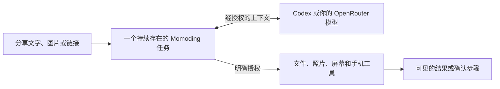

<p align="center">
  
</p>

<h1 align="center">Momoding</h1>

<p align="center"><strong>分享给它，让任务在手机上继续。</strong></p>

<p align="center">
  一个本地优先、开源的 Android 个人 AI Agent。任务状态留在你的设备上，只使用你批准的
  能力，并把执行过程和结果清楚地交还给你。
</p>

<p align="center">
  <a href="https://github.com/1zhangyy1/momoding/releases/tag/v0.1.0-alpha.4"><strong>下载 alpha.4</strong></a>
  · <a href="#三分钟开始">三分钟开始</a>
  · <a href="README.md">English</a>
</p>

<p align="center">
  <a href="https://github.com/1zhangyy1/momoding/releases"></a>
  <a href="LICENSE"></a>
  
</p>

> **开发者预览版：** Momoding 当前适合源码审阅和早期试用，不适合生产用途；尚未上架
> Google Play，也尚未经过独立安全审计。

## 从系统分享，变成一个持续任务

在其他 Android App 中，把文字、图片或链接分享给 Momoding。你可以在同一个任务中继续补充
文件和照片，并让手机上的 Agent 只调用你明确启用的 Android 能力。

| 带入真实上下文 | 让工作持续下去 | 控制权仍在你手里 |
| --- | --- | --- |
| 分享文字、图片、链接、文件，或直接拍一张照片。 | 对话、计划、Goal、工具结果和恢复状态都会跟随任务。 | 系统权限、敏感读取和重要修改都有明确边界。 |

Momoding 不是远程控制 Shell，也不只是套着聊天界面的模型。Pi Agent 循环运行在手机上；凭据、
权限、策略检查和设备侧副作用仍由 Android 掌控。



## 现在可以试什么

- **从其他 App 继续一件事。** 把文字、图片或链接分享到一个新任务，不必在另一个聊天框里
  重新拼凑上下文。
- **使用手机里的上下文。** 添加文件和照片、拍照、查看照片 metadata，或调用有界的日历、
  联系人、位置、剪贴板和 Momoding 自有通知工具。
- **运行不止一轮对话的工作。** 任务可以跨会话保留计划、Goal、Skill、子 Agent、审批与恢复
  状态。
- **谨慎启用更强的 Android 能力。** 屏幕捕获、基于无障碍的界面检查与受控操作、共享存储、
  应用信息，各自都有独立的系统授权门。

这些能力仍处于实验阶段，也会受到 Android 版本和设备 Provider 的影响。Momoding 会展示实时
权限和可用性；无法确认操作结果时，应当失败关闭，而不是假装成功。

## 三分钟开始

1. 在 **Android 11 或更高版本**的设备上，下载已签名的
   [`momoding-0.1.0-alpha.4.apk`](https://github.com/1zhangyy1/momoding/releases/download/v0.1.0-alpha.4/momoding-0.1.0-alpha.4.apk)
   及对应的 [SHA-256 校验文件](https://github.com/1zhangyy1/momoding/releases/download/v0.1.0-alpha.4/momoding-0.1.0-alpha.4.apk.sha256)。
2. Android 提示时，允许当前浏览器或文件管理器安装此 App。正式包名是 `app.momoding`。
3. 在 Momoding 中选择模型连接方式：
   - 使用 ChatGPT 登录可选的 Codex Provider；或
   - 填写自己的 OpenRouter API Key，并选择支持的模型。
4. 在 Momoding 中新建任务，或从其他 App 使用 Android 的**分享**动作。

Momoding 不会内置模型凭据。从 alpha.3 开始，可以在
`设置 → 关于 Momoding → 检查更新` 中发现新版本；App 会校验摘要、包名、版本号和发布签名，
再打开 Android 系统安装器，最终安装仍需要你确认。

公开 APK 是 Core Release 构建：包含运行在手机上的 Pi Agent 和已经审阅的 Android 能力，
但不包含仅用于 Debug 构建的 PRoot/Alpine 项目命令环境。

## 隐私、联网与埋点

当前 Alpha **没有接入产品分析、广告或崩溃上报 SDK**，也没有 Momoding 账号或由 Momoding
运营的云同步。

“本地优先”不等于“完全离线”：

- 凭据、任务状态、能力状态、审批与副作用记录由 Android App 在本地控制；
- 你授权的提示词和工具内容会发送给你选择的模型服务；
- 检查和下载更新时会访问 GitHub Releases；
- 手机能力受 App 界面和 Android 系统展示的权限约束。

开源早期阶段，我们先通过公开 Release 下载量、Star、Issue 和直接反馈判断需求。如果未来提议
加入可选遥测，也应该在上线前公开说明，做到数据最少、不采集内容，并且默认关闭。

## 权限边界保持可见

| 能力 | 当前边界 |
| --- | --- |
| Provider 凭据 | 使用 Android Keystore 支持的方案在本地加密；不会有意暴露给 JavaScript Runtime、日志或 APK |
| 模型请求 | 只有经授权的提示词和工具内容会发送到所选择的 Codex 或 OpenRouter 服务 |
| 项目目录 | 由用户通过 Android Storage Access Framework 选择 |
| 文件修改 | 先准备并展示变更，再经过策略检查后提交 |
| 日历与联系人 | 读写权限分开；写操作先准备并在执行后校验；厂商 Provider 行为可能不同 |
| 位置与剪贴板 | 只在前台访问，输出有界，并受 Android 权限与内容检查约束 |
| 照片 | 受当前授权范围、不透明句柄、策略检查和必要的 Android 系统确认约束 |
| 屏幕与界面控制 | 屏幕捕获由用户主动启动；无障碍服务需明确开启；界面操作使用最新节点句柄 |
| 已安装应用 | 需要单独授权 Shizuku；只提供有界、只读的应用信息 |
| 项目命令 | 仅在 Debug 构建中提供；PRoot 不是面向恶意代码的安全沙箱 |

完整说明见[安全模型](docs/SECURITY_MODEL.md)。这些设计用于减少越权和误操作，不构成形式化
安全证明。

## 当前状态

| 平台 | 状态 |
| --- | --- |
| Android | 当前主要实现；开源开发者预览版 |
| iOS | 可行性探索中；尚未承诺发布日期 |
| 其他平台 | 长期方向；尚未承诺具体形态或发布日期 |

当前 Android Domain Tools 的真机 Gate 还不是完整发布 PASS。在 Android 13 的小米 12X 上，
日历 CRUD、精确定位、剪贴板、Momoding 自有通知和媒体收藏核心路径已经实际执行，但生命周期与
厂商覆盖仍不完整。其中，小米账号联系人删除后，系统 Provider 仍保留记录，因此无法确认删除
成功。

每个版本的变化见[更新日志](CHANGELOG.md)。Momoding 是独立项目，与 OpenAI、OpenRouter、
Shizuku 及 Pi 上游维护者不存在隶属关系或官方背书。

## 从源码构建

### 环境要求

- JDK 17
- Android SDK Platform 37.0（`platforms;android-37.0`）、Build Tools 37.0.0、NDK 28.2.13676358
- Node.js 22.22.3、npm 10.9.8
- Git、curl、patch、ripgrep

请设置 `JAVA_HOME` 和 `ANDROID_HOME`，不要提交 `local.properties`。

```bash
npm ci --prefix mobile-runtime-js
npm run check --prefix mobile-runtime-js

JAVA_HOME=/path/to/jdk-17 \
ANDROID_HOME=/path/to/android-sdk \
./android-app/gradlew -p android-app \
  testDebugUnitTest lintDebug assembleDebug assembleRelease
```

Debug 构建会下载固定版本的 PRoot、talloc 和 Alpine 源码/资源，校验 SHA-256 后生成手机本地项目
环境。在完整审查对应源码和第三方声明义务之前，不应对外分发生成的 APK。

完整仓库验证：

```bash
./scripts/verify.sh
```

## 仓库结构

```text
android-app/        Android 应用、Room 存储、设备策略、界面与测试
mobile-runtime-js/  为 QuickJS 构建的固定版本 Pi Runtime
wire/               共享协议与 Kotlin 合约
scripts/            Runtime 构建、验证与公开发布检查
third_party/        复现可选原生组件所需的已审阅补丁
```

公开仓库由明确白名单生成。内部调研、真机记录、凭据、远程 Host 服务、内部编排代码和历史验证
材料不会进入公开仓库。详见[开源范围](OPEN_SOURCE_SCOPE.md)。

## 一起把 Momoding 做出来

- 试用最新 Alpha，告诉我们你打开它后最想完成的第一个任务。
- 针对一个具体工作流[提交功能建议](https://github.com/1zhangyy1/momoding/issues/new?template=feature_request.yml)，
  不要只写一个宽泛的能力名。
- [报告可复现问题](https://github.com/1zhangyy1/momoding/issues/new?template=bug_report.yml)时，
  请移除凭据、私有文件、账号信息和设备标识。
- 提交 Pull Request 前请阅读 [CONTRIBUTING.md](CONTRIBUTING.md)。安全问题请按
  [SECURITY.md](SECURITY.md) 私下报告。

## 许可证

Momoding 自有源码使用 [MIT License](LICENSE)。打包或构建时获取的第三方组件继续适用其原始
许可证，详见 [THIRD_PARTY_NOTICES.md](THIRD_PARTY_NOTICES.md)。
